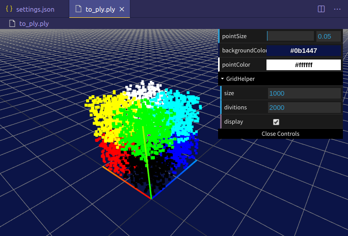
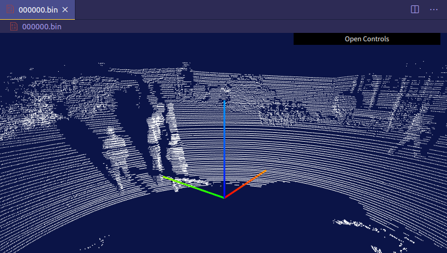

# vscode-pc-viewer
## About
This extension allows displaying the point cloud of a file in a vscode window. This extension supports the following formats:

- `ply` : Polygon File Format
- `pcd` : Point Cloud Data
- `bin` : binary file for Kitti dataset

## Note
### Axis Helper
The X axis is red. The Y axis is green. The Z axis is blue.

## References
1. [Microsoft. vscode-extension-samples. https://github.com/microsoft/vscode-extension-samples, Accessed: 2020-04-23.](https://github.com/microsoft/vscode-extension-samples)
2. [slevesque. vscode-3dviewer. https://github.com/stef-levesque/vscode-3dviewer. Accessed: 2020-04-23.](https://marketplace.visualstudio.com/items?itemName=slevesque.vscode-3dviewer)
3. [tomoki1207. vscode-pdfviewer. https://github.com/tomoki1207/vscode-pdfviewer. Accessed: 2020-04-23.](https://marketplace.visualstudio.com/items?itemName=tomoki1207.pdf)
4. [three.js. https://threejs.org/. Accessed: 2020-04-23.](https://threejs.org/)

